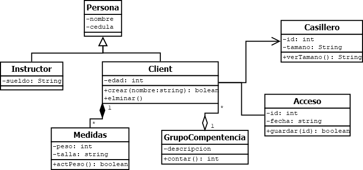
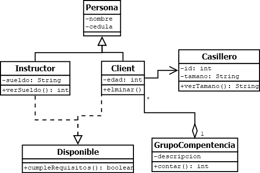

# Asignatura Programacion Orientada a Objetos

## Unidad uno
### Ejemplo relaciones clases en Java
#### UML clases

[*Código* Relaciones en Java](https://github.com/maguaman2/class-sud-2nd-poo-oct21/tree/main/01-fundamentos-poo/clases-ejemplos/relaciones-clases)
### Tareas 
#### Semana 4
Codificar el siguiente diagrama:

## Unidad dos
## Unidad tres

